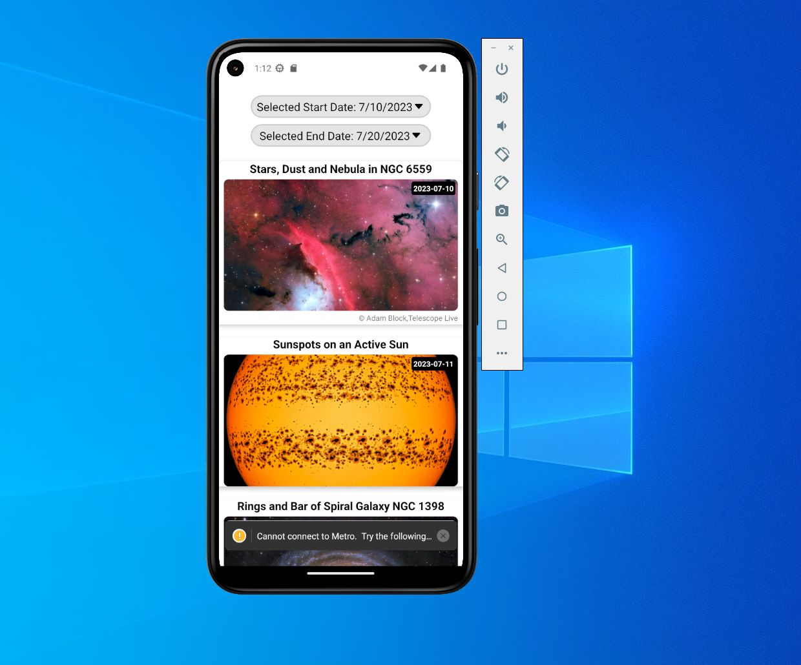

# APOD Expo React Native Project




One of the most popular websites at NASA is the Astronomy Picture of the Day (APOD).
Get API KEY and paste in .env file as EXPO_PUBLIC_API_KEY="your token"

## Getting Started

Follow the instructions below to get a copy of the project up and running on your local machine.

### Prerequisites

- [Node.js](https://nodejs.org) (LTS version recommended)
- [npm](https://www.npmjs.com) or [Yarn](https://yarnpkg.com)

### Installation

1. Clone the repository:

```bash
git clone https://github.com/your-username/my-expo-react-native-project.git
cd my-expo-react-native-project
npm install
# or
yarn
npm start
# or
yarn start

The full documentation for this API can be found in the https://github.com/nasa/apod-api
